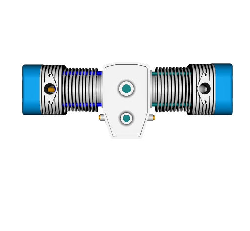

<!-- README.md is generated from README.Rmd. Please edit that file -->

# rgl2gltf: Read and write .gltf and .glb files

This R package contains functions to read, write and display `.gltf` and
`.glb` files containing 3D models, following the [official spec at
khronos.org](https://registry.khronos.org/glTF/specs/2.0/glTF-2.0.html)
. It also contains functions to convert `rgl` scenes and `mesh3d`
objects to and from glTF objects.

It is still in active development. Please add issues or pull requests if
something important to you is missing.

A `pkgdown` website is here: <https://dmurdoch.github.io/rgl2gltf/dev/>

To install from CRAN, run

``` r
install.packages("rgl2gltf")
```

To install the development version, run

``` r
remotes::install_github("dmurdoch/rgl2gltf")
```

Sample code:

``` r
library(rgl)
library(rgl2gltf)

gltf <- readGLB("https://github.com/KhronosGroup/glTF-Sample-Models/blob/master/2.0/2CylinderEngine/glTF-Binary/2CylinderEngine.glb?raw=true")
mesh <- as.mesh3d(gltf)
plot3d(gltf)
snapshot3d(webshot = FALSE, filename = "man/figures/engine.png")
```



## Copyright

Most of this package is written by Duncan Murdoch and licensed under GPL
2.0.

Sample files in `inst/glb` and `inst/localtests` are unmodified copies
of files from
<https://github.com/KhronosGroup/glTF-Sample-Models/tree/master/2.0>,
and have details of copyright and licenses listed there. All have
permissive licenses, some requiring acknowledgment.

Files in `inst/localtests` are in the Github repository, but are not
included in the package tarball.

Briefly,

-   `2CylinderEngine.glb` was produced by Okino Computer Graphics.
-   `AntiqueCamera.glb` was produced by Maximilian Kamps and UX3D.
-   `Avocado.glb` was produced by Microsoft.
-   `BarramundiFish.glb` was produced by Microsoft.
-   `BoxAnimated.glb` was produced by Cesium.
-   `BrainStem.glb` was created by Keith Hunter and is owned by Smith
    Micro Software, Inc. 
-   `DamagedHelmet.glb` was created by theblueturtle\_.
-   `NormalTangentTest.glb` and `NormalTangentMirrorTest.glb` were
    created by Ed Mackey and are owned by Analytical Graphics, Inc.,
    licensed under CC-BY 4.0
    <https://creativecommons.org/licenses/by/4.0/>.

Files `src/mikktspace.c` and `src/mikktspace.h` are written by Morten S.
Mikkelsen and used under the permissive license included within them,
with slight modifications for C99 compatibility.
